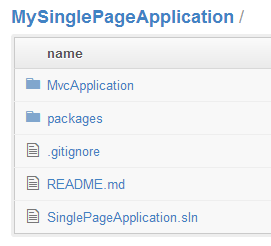

# GitHub Service Hooks: AppHarbor

## Introduction

The last 7 posts discussed how you can create a single-page application using [GitHub](https://github.com/geersch/GettingStartedWithGitHub), [Twitter Bootstrap](https://github.com/geersch/TwitterBootstrap), [MongoDB](https://github.com/geersch/GettingStartedWithMongoDB) and [Knockout.js](https://github.com/geersch/KnockoutSpa/blob/master/src/part-1/README.md).

One last thing I touched briefly during my session in September is continuous deployment using [AppHarbor](https://appharbor.com/). If you are not familiar with AppHarbor, it's basically .NET as a service where you can deploy a .NET application to the cloud.

In this tutorial let's create a small web application, use GitHub for source control and automatically deploy any commits directly to our AppHarbor hosted site.

## Single-page Application

First we'll need a site which we can add to GitHub. Let's use the single-page application created earlier during the 4-part Knockout.js series. I'm using this site as it also uses MongoDB. When deploying to AppHarbor we'll need to replace the connection string to reflect the new environment. We'll get back to that later.

You can download the application here:

[Single-page application using Knockout.js](http://dl.dropbox.com/u/40603470/SinglePageApplicationPart4.zip)

If you haven't followed the [Knockout series](https://github.com/geersch/KnockoutSpa) you can have a quick look, but it's not required to be able to follow along

## GitHub Repository

Once you've downloaded the source code, go ahead and extract it.


Log in to your [GitHub account](https://github.com/login) and create a new (public) repository called MySinglePageApplication.


Make sure to initialize it with a README and a [.gitignore file for C#](https://dl.dropbox.com/u/40603470/.gitignore).

Once the remote repository has been created, open up GitHub for Windows and clone it to a local repository.


When cloned, copy and paste the extracted files in this local repository.


Time to commit. Open up a GitHub shell for the repo and push the new files to the remote repository. You need to execute the following commands:

```sh
it add .
git commit -m "Initial commit"
git push
```

Once you execute the "git push" command your new code files will be uploaded to your remote repository. This will probably take a minute or two.


Alright, the remote repository now contains the code for our single-page application.



If you are new to GitHub, be sure to read my post on [getting started with GitHub](https://github.com/geersch/GettingStartedWithGitHub) first.

## AppHarbor

If you haven't signed up with AppHarbor yet, go ahead and [create a free account](https://appharbor.com/user/new). Once signed in create a new application called MySinglePageApplication. Be sure to select United States or Europe depending on your actual location.


When the application has been created you'll automatically be redirected to its dashboard. On the lefthand menu you should see a button labelled BUILD URL.


Click it. This copies the application's build URL to the clipboard. The URL has the following pattern:

https://appharbor.com:443/applications/mysinglepageapplication/builds?authorization=**YOUR\_AUTHORIZATION\_ID**

Copy the value of the authorization query parameter into your clipboard. You won't need the rest of the URL.

## Service Hook

Your application has now been configured in GitHub and AppHarbor. Time to link the two. Go back to your GitHub account and go the MySinglePageApplication repository's admin section. In the lefthand menu click the service hooks option.


You'll be presented with a very long list of available service hooks. Locate the AppHarbor hook and select it. To link GitHub to AppHarbor you need to complete the following form:


Just enter "MySinglePageApplication" for the application slug and copy / paste the authorization ID from AppHarbor's build URL into the token field. Check the active checkbox and finally click Update Settings.

That's it. Your GitHub account is now linked to your AppHarbor application. Each time you push your commits to your remote repository GitHub will trigger the service hook and notify AppHarbor. AppHarbor in its turn will pull in the source code, build your application and automatically deploy it.

## MongoDB

There's just one last thing we need to address. Our application uses MongoDB, this hasn't been setup for the AppHarbor hosted application yet. Let's rectify this. Go back to your application's dashboard on AppHarbor and select the Add-ons menu item.

Locate the MongoHQ add-on and click the "See more" link.


Go ahead and install the free sandbox version which offers you 16 MB of storage.


Voila, you've just added MongoDB support to your application. How does AppHarbor know how to replace your MongoDB connection string with its own? A simple naming convention does the trick. Just make sure you add your MongoDB connection string under the Web.config's appSettings node and call it MONGOHQ_URL.

Go ahead and rename the connection string for the single-page application demo (Web.config + TimesheetsController.cs). Save the changes, commit and push them to the remote repository.

GitHub's AppHarbor service hook will now deliver the payload to AppHarbor which in its turn will build and deploy your application. Just check your application's dashboard on AppHarbor. Here you can follow the build's progress.


On the top of the page you'll find a "Go to your application" link. Click and you'll notice that within a couple of minutes your new changes will have been deployed.
